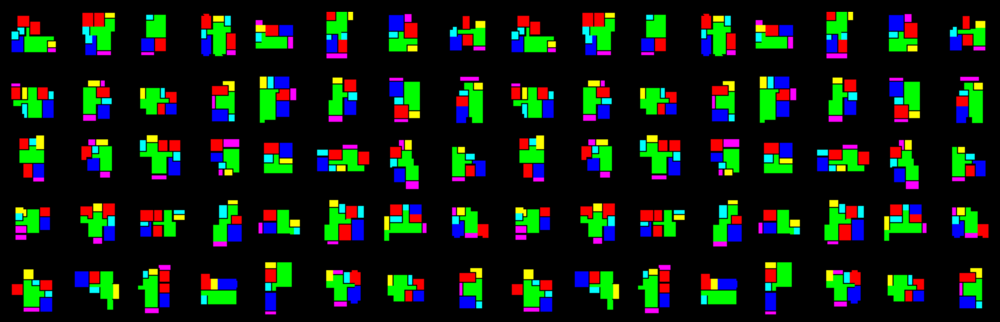

This repository is a part of a larger project named Graph2Layout. RPLAN graph representation is a new representation of RPLAN dataset suitalbe for Graphical DeepLearning tasks. In this project, graphical features have been extracted from RPLAN dataset. Since the RPLAN dataset does not include information on the adjacencies of the spaces, the adjacency matrix was created using a pre-processing technique to extract the adjacencies of each space. Additionally, from this data collection, each space type is retrieved and transformed into a 10-dimensional one-hot-encoded vector. All the processed data have finally been combined into a useful dataset for graph-based neural network tasks. In summary, the processed dataset consists of 80,000 graphs consisting of nodes and edges. Moreover, a set of data augmentation techniques were used to enhance the data to more than 200K, including horizontal and vertical flipping and center cropping.      

 

 
 
  
 

